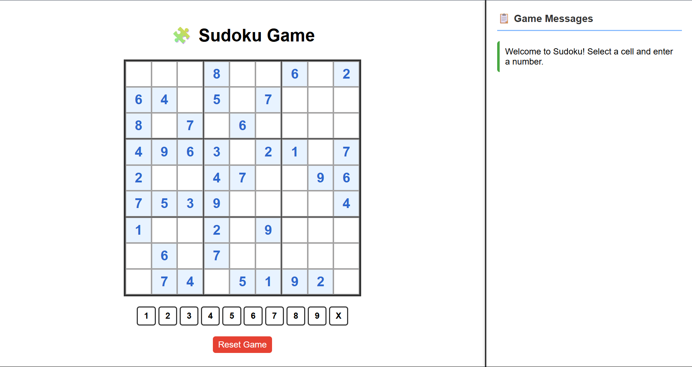

# 🧩 Sudoku Game

[](https://sudoku-game-t2nu.onrender.com)

A web-based interactive Sudoku game built using **Flask (Python)** on the backend and **HTML/CSS/JavaScript** on the frontend. Play, reset, and solve Sudoku puzzles with intuitive UI and live validation of moves!

👉 Try it here: [sudoku-game-t2nu.onrender.com](https://sudoku-game-t2nu.onrender.com)

## 🚀 Features

- ✅ 9x9 interactive Sudoku board
- 🔢 Click-based number input with a number pad
- 🔒 Locks initial puzzle cells to prevent editing
- ❌ Real-time validation of row, column, and box rules
- 🧠 Victory detection when puzzle is solved correctly
- 🔁 Reset button to restart the puzzle anytime
- 🧾 Message panel to show all move history with timestamps

## 🖼️ Screenshots



## 🛠️ Tech Stack

**Frontend:**
```
- HTML5
- CSS3
- JavaScript
 ```
**Backend:**
```
- Python
- Flask
- NumPy
```

**Deployment:**
```
- Render (hosting)
- GitHub for version control
```

## 📁 Project Structure
```
sudoku-game/
  ├── game.py
  ├── requirements.txt
  ├── templates/
  │   └── index.html
  └── README.md
```
## ⚙️ How to Run the Project Locally

Follow these steps to run the Sudoku Game on your local machine:

### 1. Clone the Repository
```
git clone https://github.com/Rami-Reddy-Yekkanti/sudoku-game.git
cd sudoku-game
```

### 2. Install Dependencies
```
pip install -r requirements.txt
```

### 3. Run the Flask App
```
python game.py
```

### 4. Open the Game
```
http://localhost:5000
```

## 🧑‍💻 Author: **Rami Reddy Yekkanti**
  
🚀 [Live App](https://sudoku-game-t2nu.onrender.com)  
📦 GitHub: [github.com/Rami-Reddy-Yekkanti](https://github.com/Rami-Reddy-Yekkanti)
